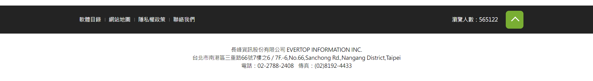

# 功能

這個網站是用來讓大家查詢特定類別內，好用的開源軟體，並附基本教學，讓讀者看完以後能夠直接上手，或著從原本習慣的專有軟體中切換過來。

# 外觀風格

### 我們需要一個標誌喔喔喔喔喔

希望可以是酷酷的，但是還是可以出圈的樣子（讓不懂電腦的人也願意嘗試的樣子）。

# 通則

* 最上方有 nav bar

* 最下方有「有的沒的」那些（像下圖）

# 備註

* 文字後面括號問號處為有餘力再做，optional 的事情。