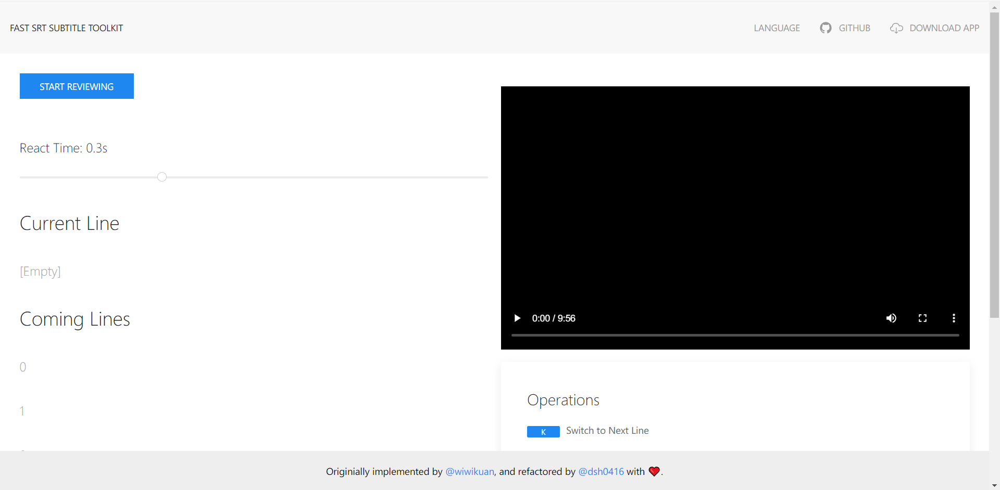
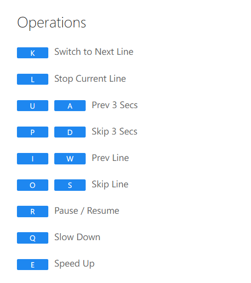
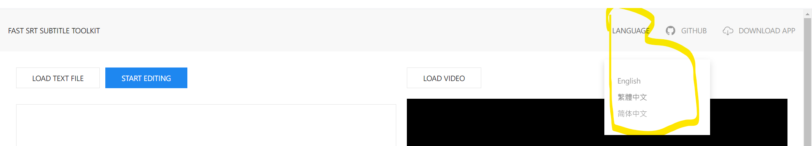
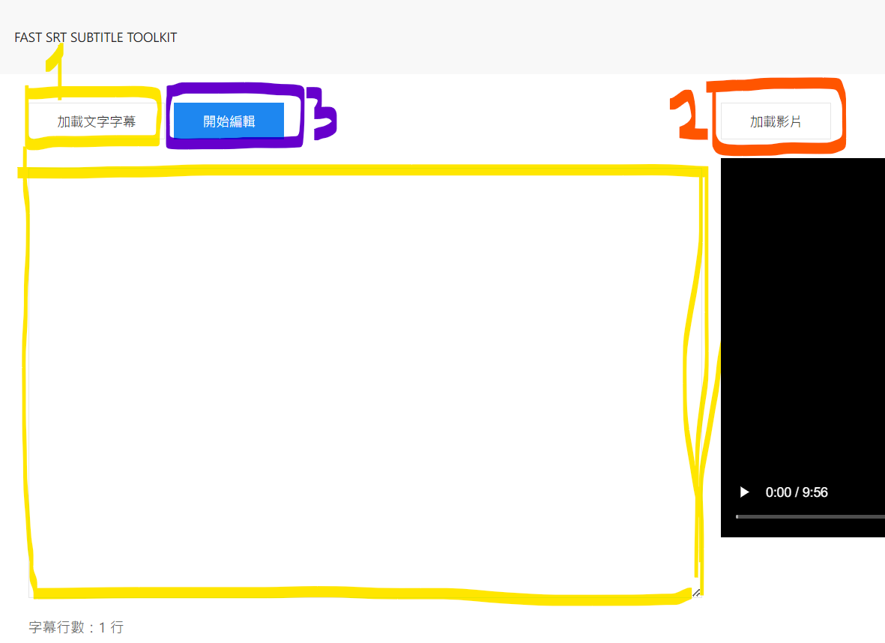

## 上區塊

* 軟體標誌：無
* 軟體名稱：FAST SRT SUBTITLE TOOLKIT
* 軟體類別：影片剪輯（上字幕）
* 軟體下載/官網連結：<https://srt.coderemixer.com/>
* 軟體的優點缺點列點顯示  
    優點：
    * 上字幕速度快
    * 可下載成 SRT、VTT  
    缺點：
    * 無法即時預覽
    * 無辨識聲音功能
    * 無顯示音軌
    * 很容易跳離網頁
* 軟體的一張截圖：

## 內文

* 完整的功能簡介

原文：
這個網站可以幫助你寫出把逐字稿對上影片的時間，變成字幕檔，以便在剪接軟體、串流平台中使用。其特色為「只需要播一次影片的時間」就能將字幕上好，因為它是透過快捷鍵來操作，所以不需要一直暫停或是來回移動滑鼠。

GPT文：
這個軟體提供了一個方便的方式來生成字幕檔，使您能夠輕鬆地將逐字稿與影片的時間對齊。它的獨特之處在於，您只需要播放影片一次，就能夠快速地將字幕添加到正確的時間軸上。這是通過使用快捷鍵來操作完成的，因此您不需要一直暫停影片或來回移動滑鼠。這樣的設計使得字幕製作過程更加高效和流暢，同時節省了您的時間和精力。無論您是在剪接軟體中還是串流平台上使用字幕，這個軟體都能夠輕鬆地滿足您的需求。

* 使用感覺（較主觀的敘述）

原文：
雖然現在 AI 上字幕的技術逐漸發展成熟了，但是如果你已經有逐字稿了，手邊也沒有高效能的電腦，使用這個網頁是筆者目前用過最有效率的方法。雖然程式本身還有些缺點（例如：無法即時預覽、無辨識聲音功能、無顯示音軌、很容易跳離網頁），但它是開源軟體，完整原始碼也不長，因此，或許你就可以成為那個優化他的人了。

GPT文：
這個網頁工具似乎在處理現有逐字稿時提供了一個相對簡單且有效的解決方案，特別是對於那些沒有高效能電腦或對 AI 字幕技術不太熟悉的人來說。雖然這個工具仍然存在一些缺點，比如無法即時預覽、無法辨識聲音、無法顯示音軌，以及易於跳離網頁等問題，但由於它是開源軟體，且原始碼不長，因此對於有興趣的人來說，可以將其優化為更強大和更全面的工具。如果您對此有興趣，您可以考慮參與到優化這個工具的過程中，成為使其更好的一部分。

* 介紹影片（如果有拍，或著找到別人做的適合的資源）
    * 嵌入 YouTube 或其他平台的影片 (iframe)

[好和弦影片](https://wiwi.video/w/ih6xvQwRPg2iaEFEyRQSPs)

不是最好的例子，因為
一、重點不在介紹軟體本身
二、出現的是軟體的前身，而非本文介紹的軟體

* 馬上入門，連結到教學的第一章（通常是如何安裝）
    * 順順的連過去，不要變成新的一頁

（但這個軟體只有單一功能，而且不用安裝，因此在這一頁內就可以搞定）

STEP1 切換語言

點選 LANGUAGE，將網頁切換成您習慣閱讀的語言。（以下以繁體中文為例）

STEP2 匯入文字與影片

一、（黃色）先點選「加載文字字幕」選取逐字稿的純文字檔案，若您尚未將每句字幕以換行排列，例如將

> 第一句 哈囉大家好
> 第二句 歡迎收看影片
> 第三句 我是XXX

排列成

> 哈囉大家好
> 歡迎收看影片
> 我是XXX

可以在文字框內編輯成以上格式。
您亦可先「加載影片」（橘色）再於文字框中聽打逐字稿。

二、（橘色）點選「加載影片」，選擇要被上字幕的影片。

三、（紫色）點選「開始編輯」，進入下一步。

* 其他類似軟體（？）